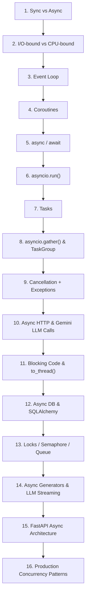

# 🐍 Python Asynchronous Programming Masterclass

> A comprehensive, hands-on masterclass covering Python's `asyncio` ecosystem from core fundamentals to production-grade concurrency patterns, complete with real-world **Google Gemini LLM** integrations.

---

## 🎯 Learning Roadmap



---

## 📚 Curriculum Structure

| # | Module Directory | Core Concepts Covered | Key Hands-on Scripts |
|---|---|---|---|
| **01** | [`01_sync_vs_async/`](./01_sync_vs_async) | Sequential vs Concurrent model, thread blocking vs single-thread non-blocking | `01_sync_demo.py`, `02_async_demo.py`, `03_comparison_benchmark.py` |
| **02** | [`02_io_bound_vs_cpu_bound/`](./02_io_bound_vs_cpu_bound) | Disk/Network wait vs CPU compute, why async shines for I/O | `01_io_bound_demo.py`, `02_cpu_bound_demo.py`, `03_benchmarks.py` |
| **03** | [`03_event_loop/`](./03_event_loop) | OS Selectors (`epoll`/`kqueue`/`IOCP`), Loop phases, Callbacks | `01_event_loop_basics.py`, `02_callbacks_and_timers.py`, `03_under_the_hood_selector.py` |
| **04** | [`04_coroutines/`](./04_coroutines) | Generator-based coroutines (`yield from`), Native coroutines (`async def`), Coroutine frame states | `01_generator_to_coroutine.py`, `02_native_coroutines.py`, `03_coroutine_states.py` |
| **05** | [`05_async_await/`](./05_async_await) | `async`/`await` keywords, Awaitables (`Coroutine`, `Task`, `Future`) | `01_await_mechanics.py`, `02_awaitables_coroutines_tasks_futures.py`, `03_common_pitfalls.py` |
| **06** | [`06_asyncio_run/`](./06_asyncio_run) | `asyncio.run()` entry point, loop lifecycle, task cleanup | `01_asyncio_run_entry.py`, `02_loop_lifecycle.py`, `03_nested_run_anti_pattern.py` |
| **07** | [`07_tasks/`](./07_tasks) | `create_task()`, Background execution, Task state, `asyncio.shield()` | `01_creating_tasks.py`, `02_task_lifecycle_and_naming.py`, `03_background_tasks_shielding.py` |
| **08** | [`08_asyncio_gather/`](./08_asyncio_gather) | `asyncio.gather()`, `return_exceptions`, Python 3.11+ `TaskGroup` | `01_gather_basics.py`, `02_gather_return_exceptions.py`, `03_modern_task_group.py` |
| **09** | [`09_cancellation_exceptions/`](./09_cancellation_exceptions) | `Task.cancel()`, `CancelledError`, `wait_for()`, `ExceptionGroup` | `01_task_cancellation.py`, `02_timeouts_wait_for.py`, `03_exception_handling_and_groups.py` |
| **10** | [`10_async_http_llm_calls/`](./10_async_http_llm_calls) | `httpx.AsyncClient`, Google Gemini API (`google-genai`), Async batching | `01_async_httpx_basics.py`, `02_gemini_async_llm.py`, `03_batch_llm_prompts.py` |
| **11** | [`11_blocking_code_to_thread/`](./11_blocking_code_to_thread) | Offloading sync code, `asyncio.to_thread()`, `ThreadPoolExecutor` | `01_blocking_problem_demo.py`, `02_asyncio_to_thread.py`, `03_custom_executor.py` |
| **12** | [`12_async_db_sqlalchemy/`](./12_async_db_sqlalchemy) | Async SQLAlchemy 2.0, `AsyncSession`, SQLite + `aiosqlite`, ORM CRUD | `01_async_sqlalchemy_setup.py`, `02_async_crud_operations.py`, `03_transactions_and_sessions.py` |
| **13** | [`13_locks_semaphore_queue/`](./13_locks_semaphore_queue) | `asyncio.Lock`, `Semaphore` (rate limits), Producer-Consumer `Queue` | `01_async_lock.py`, `02_semaphore_rate_limiting.py`, `03_async_queue_producer_consumer.py` |
| **14** | [`14_async_generators_llm_streaming/`](./14_async_generators_llm_streaming) | `async def` generators, `async for`, Real-time Gemini token streaming | `01_async_generators_basics.py`, `02_gemini_llm_streaming.py`, `03_pipeline_with_async_gen.py` |
| **15** | [`15_fastapi_async_architecture/`](./15_fastapi_async_architecture) | FastAPI async vs sync routes, threadpool behavior, async DB integration | `main.py`, `01_async_vs_sync_endpoints.py`, `02_background_tasks_db.py` |
| **16** | [`16_production_concurrency_patterns/`](./16_production_concurrency_patterns) | Exponential backoff retries, Bounded worker pool, Circuit breaker, Shutdown | `01_retry_with_backoff.py`, `02_bounded_worker_pool.py`, `03_circuit_breaker.py`, `04_graceful_shutdown.py` |

---

## 🛠️ Environment Setup & Prerequisites

### 1. Requirements
- **Python Version**: Python 3.11+ (Python 3.12 recommended)
- **Gemini API Key**: Set your Gemini API key in your environment before running LLM modules (10, 14, 16):
  ```bash
  # Windows PowerShell
  $env:GEMINI_API_KEY="your_api_key_here"

  # Linux / macOS
  export GEMINI_API_KEY="your_api_key_here"
  ```

### 2. Installation
Create and activate a virtual environment, then install dependencies:

```bash
python -m venv venv

# On Windows
venv\Scripts\activate

# On Linux/macOS
source venv/bin/activate

# Install required packages
pip install -r requirements.txt
```

---

## 💡 How to Use This Repository

1. **Step-by-Step Learning**: Navigate into each module directory sequentially (`01_sync_vs_async`, `02_io_bound_vs_cpu_bound`, etc.).
2. **Read the Module Documentation**: Every folder contains a comprehensive `README.md` breaking down the core theoretical concepts, execution flow, diagrams, common pitfalls, and exercise questions.
3. **Execute the Hands-on Code**: Run each Python script in your terminal to see concurrency timing, memory mechanics, and LLM responses in action:
   ```bash
   python 01_sync_vs_async/01_sync_demo.py
   python 01_sync_vs_async/02_async_demo.py
   ```

---

## 🏆 Key Takeaways & Best Practices

- **Async is for I/O, not CPU**: Asynchronous programming frees up execution threads while waiting for network/disk operations. Use `asyncio.to_thread()` or `ProcessPoolExecutor` for heavy math.
- **Never block the Event Loop**: Avoid `time.sleep()`, synchronous `requests`, or heavy synchronous file I/O inside coroutines. Use non-blocking libraries (`httpx`, `aiofiles`, `aiosqlite`) or thread offloading.
- **Structured Concurrency**: Use `asyncio.TaskGroup` (Python 3.11+) over `asyncio.gather()` when you need automatic context cleanup and error propagation.